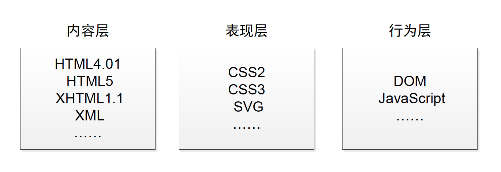

# Web 标准 {#web-standard}

## Web 标准产生背景

HTML 语言自 1989 年诞生以来，数以万计的网站使用 HTML 语言建立了起来，HTML 语言及浏览器的发明，大大提高了互联网的使用效率，将互联网从原来只在大学、军队等专业机构小范围的使用，普及到了更为广泛的一般用户，随着上网用户的增加，由互联网带来的商业机会也涌现了出来，伴随而来的，是众多不同厂商的浏览器试图建立对 HTML 语言的影响力。

尽管 HTML 对于所有计算机都是可用的，但是这并不意味着用户都能以相同的方式体验它，这些页面的实际显示效果取决于计算机的类型、显示器、网速以及查看页面的软件（浏览器），当今最流行的浏览器是 Internet Explorer、Firefox、Chrome、Safari 等等，同时，用手机上网的用户也逐渐增多并已成为主流。不幸的是，这些浏览器显示页面的方式并不完全相同。

造成这些不同的主要原因在于对商业利益的追逐和保护。1994 年，网景公司（Netscape Communication）在万维网上建立起了第一道栅栏，开始了所谓的“浏览器之争”。为了吸引用户，网景公司创建了一套只有 NetScape 能够处理的 HTML 扩展，使用 NetScape 浏览器冲浪的用户可以查看到改进的页面，如标题比其他文本大且粗、段落上下有间距、无序列表的每个项目之前有小黑点等等。许多人喜欢这些扩展，所以 NetScape 浏览器一度成为最为流行的浏览器。微软公司发现自己在这个市场上处于不利地位时，他们决定用自己的浏览器 Internet Explorer 来参与竞争，除了使用与操作系统捆绑销售的策略之外，同样为了吸引用户，他们增加了只有微软的 IE 浏览器能够识别的扩展。就这样，两个公司借助于网络设计者和开发者，为 HTML 增加了只适用于各自浏览器的扩展，更糟糕的是，其他一些浏览器开发商也加入了这场用户争夺战，这样导致结果就是，对于网络内容提供者而言，要试图创建一个适用于所有浏览器的网站变成一个很让人头疼的问题。

万维网创始人蒂姆·伯纳斯-李爵士希望万维网能像人的大脑那样在信息之间建立广泛的联系，并且应该对所有计算机开放，这个愿景被人们称为万维网的普适性原则。而这种浏览器的专有属性的不断推出，违背了蒂姆·伯纳斯-李所推崇的普适性的愿望。蒂姆·伯纳斯-李所领导的万维网“联合国”W3C（World Wide Web Consortium 万维网联盟）制订了一系列标准，将一些扩展吸收到了正式规范中，而将其他扩展完全取消了，推出了所谓的 Web 标准。Web 标准的目标是使 Web 社区意识到普适性的重要意义，同时尽可能满足开发优美页面的愿望，努力拆除现有私有扩展，避免万维网出现分崩离析的局面。

早期版本的 HTML 将内容、结构和格式化指令组合在一个文档中，这虽然比较简单，但不够强大。W3C 设计了一个新系统——CSS，在这个系统中，格式化指令与内容和结构分开保存，因此可以根据需要将格式化指令或者样式应用到单一段落或者整个网站。并将 HTML 中那些用来表现内容形式的元素标记为“已废弃”，不鼓励人们去使用它们。

CSS 的理想是实现内容和表现方式的完全分离。将文档中的内容和表现相分离具有很多好处，人们可以轻松地增加、移除或更新内容，而不影响布局，还可以简单地改变整个站点的外观而不影响内容，从而使得网站的建设工作更有效率。

## Web 标准的内容

就目前而言，Web 标准表示的是由 W3C 组织定义并维护的、非私有化的一系列标准和规范。在近些年，Web 标准常常指的是将网页中的内容、表现、行为三者相分离的思想和相关的实现方法。按照 Web 标准，构建精良的 Web 文档应该有三层各自分离的资料层，详见下图：

```{r webstandard, echo=FALSE, out.width='95%', fig.show='hold', fig.cap='Web 标准', fig.align='center'}

```

第一层是结构层，它包括文档的内容以及表示文本各部分的语义信息，如标题、段落、列表、导航条等等。这一部分的实现通过 HTML 或者 XHTML 来实现。

第二层是表现层，它决定了网页以何种方式显示，包括布局、排版、颜色、装饰、图片等等详细信息，在一些非视觉设备如屏幕阅读器上可能通过声音来呈现文字，这一部分使用用 CSS 来实现的。

除了内容层和表现层，还有一层是行为层。这一层主要是根据用户的动作，使用脚本来更新、增添或移除文档中的某些项目，已达到更好的交互效果。

我们最终看到的页面通常都是通过 HTML、CSS 和 JavaScript 配合来实现的，其中 HTML 和 CSS 是必不可少的手段，JavaScript 脚本在需要的时候才会使用。

## 扩展阅读材料

1. <https://www.w3.org/standards/>
