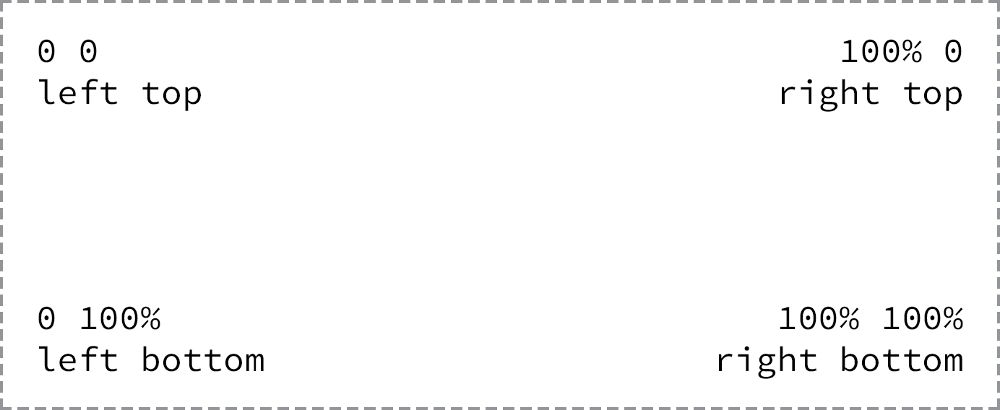

# 背景 {#css-background}

CSS 中提供了为元素设定背景的功能，我们看到许多设计精良的网页，在很大程度上是灵活运用 CSS 背景实现装饰效果的。在 CSS 中，不但可以为整个网页设定背景，也可为具体元素设定背景，任何可显示出来的元素都可以设定背景样式。

## 设置背景色

CSS 通过 `background-color` 属性为元素设定背景颜色，颜色值的设定同 color 属性。`background-color` 属性的默认值为 `transparent`（透明）。如下例中的规则将使段落中的内容颜色为黑色，段落的整体背景色为浅灰色。

``` css
p {
    background-color: #eee;
    color: black;
}
```

## 设置背景图片

一般情况下，我们会认为色块过于单调，缺少变化，因此，我们可以使用 CSS 提供的图像背景来装饰页面。在 CSS 中和图像背景有关的属性有：

1. **background-image** 用来指定作为背景使用的图片所在的地址，它的值为 `URL` 地址或者`渐变色`，默认值为 `none`。此外，当同时定义了背景颜色和背景图像时，背景图像覆盖在背景颜色之上。
1. **background-repeat** 来设定背景图片的重复方式，`background-repeat` 的值有：`repeat`（沿水平和垂直方向平铺）、`repeat-x`（沿水平方向平铺）、`repeat-y`（沿垂直方向平铺）或者 `no-repeat`（不平铺显示），默认值为 `repeat`。
1. **background-position** 用来设定背景图像的位置，位置信息有两个，第一个用来指定横向坐标，第二个用来指定纵向坐标。坐标的表示可以使用百分数、带单位的长度以及关键字（`left`、`center`、`right`、`top`、`middle`、`bottom`），默认值为 `0`。
1. **background-attachment** 用来设定背景图像的滚动模式。值有三个，其中 `scroll` 表示背景图像会随着页面窗口滚动；`fix` 表示固定在窗口，不随其滚动；`local` 表示元素随元素滚动时背景图像也会跟着滚动，因为背景图像总是要跟着内容。`local` 值是 CSS3 新增的值。`background-attachment` 默认值为 `scroll`。

例如：

``` css
div#footer {
    background-image: url(bg.png);
    background-repeat: no-repeat;
    background-attachment: scroll;
    background-position: center bottom;
}
```

上述规则为 `id` 等于 `footer` 的 `div` 元素指定背景图像，背景图像的来源为当前网页同级目录中的 `bg.png` 文件，该图片在元素背景范围内部重复，并且随网页滚动，图片的出现在 `div` 元素背景范围内居中靠下的位置。

其中，`background-position` 属性，可以使用 `top`、`right`、`bottom`、`left` 和 `center` 关键字以及像素、百分比或者其他长度单位。CSS 在定位时，坐标原点位于左上角，如下图所示：

```{r css-background, echo=FALSE, out.width='95%', fig.show='hold', fig.cap='CSS 坐标体系', fig.align='center'}

```

通常情况下，我们将 `background-color`、 `background-image`、 `background-position`、和 `background-repeat` 属性简写到 `background` 属性中。简写时，属性的顺序有多种，普遍采用 `background-color`、 `background-image`、 `background-position`、和 `background-repeat` 的顺序。例如：

``` css
div {
  background: #b2b2b2 url("alert.png") 20px 10px no-repeat;
}
```

## 设置线性渐变背景

许多年以来，设计师和开发人员若要实现背景渐变效果，只能使用图像处理软件制作渐变背景图片。但在 CSS3 中，我们现在可以使用渐变背景属性来代替以往繁琐的做法，只需一条语句，就可以实现漂亮的渐变背景效果。

CSS 的线性渐变背景是在 `background` 或者 `background-image` 属性中使用 `linear-gradient()` 函数实现，例如：

``` css
div {
  background: #466368;
  background: linear-gradient(#648880, #293f50);
}
```

`linear-gradient()` 函数必须包括至少两个值，第一个值为渐变起始值，第二个值为渐变结束值，浏览器会计算并平滑渲染出介于这两个颜色值之间的内容。

在渐变色背景之前，我们还声明了背景色，这样做的目的是当浏览器不支持渐变色属性时，使用指定的背景色作为背景。

默认情况下，线性渐变的方向为从上至下，我们可以在颜色值之前，使用关键词或者角度来改变渐变的方向。例如：

``` css
div {
  background: #466368;
  background: linear-gradient(to right bottom, #648880, #293f50);
}
```

上例中，我们生成了一个从左上角渐变到右下角的渐变填充背景。

除了使用关键字之外，还可以使用角度，例如，如果我们想要生成和上例类似的渐变填充，可以使用 `135deg` 调整渐变角度：

``` css
.deg {
    background: #466368;
    background: linear-gradient(135deg, black, white);
    border-radius: 6px;
    height: 120px;
}
```

## 设置径向渐变

线性渐变非常适合从不同方向之间的渐变，不过有时候，我们还需要径向渐变。径向渐变使用 `radial-gradient()`，其他类似于线性渐变。例如：

``` css
div {
  background: #466368;
  background: radial-gradient(#648880, #293f50);
}
```

## 使用多个色标

要实现渐变效果，最少需要两个颜色值。但我们还可以使用多个色标，生成不同颜色值之间的渐变效果，不同颜色值会在指定的方向上平均分布，如：

``` css
div {
  background: #648880;
  background: linear-gradient(to right, #f6f1d3, #648880, #293f50);
}
```

对于新手而言，手工生成复杂的渐变效果还是比较困难的，幸运的是，网络上有很多可以在线生成渐变效果的工具，如 [CSS3 gradient generators](http://www.cssmatic.com/gradient-generator)，借助于这些工具，新手可以学习复杂渐变的生成代码。
