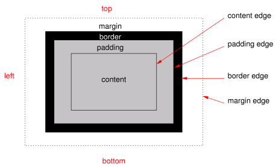

# 盒模型  {#css-box}

在理解 CSS 是如何控制页面显示效果的时候，我们必须要掌握盒模型（Box Model）和定位（position）机制。CSS 借助于盒模型和定位机制，结合文档树，能够精确、高效地控制内容在页面中的位置，从而实现页面的布局。

## 盒模型的概念

所有 HTML 元素，在页面的呈现过程中，都遵循 CSS 制定的盒模型（Box Model），盒模型是一个包含外边距、边框线、内边距以及内容的矩形容器。具体如下图所示：

```{r css-box, echo=FALSE, out.width='95%', fig.show='hold', fig.cap='CSS 盒模型', fig.align='center'}

```

从图中我们可以看到，元素的盒模型由外边距 (`margin`)、边框线 (`border`)、内边距（`padding`）以及元素的内容（`content`）构成，CSS 对外边距、边框线、内边距的控制可以分方向进行，也可以整体控制，如上图中的 TM 就表示上侧外边距、LM 表示左侧外边距、RM 表示右侧外边距、BM 表示底侧外边距。

在 CSS 中，直接用来描述盒模型的属性有 margin、border、padding、width、height。需要注意的是，CSS 提供的宽度属性（width）和高度属性（height）指的是内容区域（content）的宽度和高度，而不是整个盒模型的宽度和高度。整个盒模型的大小应该包括内外边距及边框的宽度。

盒模型的宽度 = "`margin-left`" + "`border-left`" + "`padding-left`" + "`width`" + "`padding-right`" + "`border-right`" + "`margin-right`"

盒模型的高度 = "`margin-top`" + "`border-top`" + "`padding-top`" + "`height`" + "`padding-bottem`" + "`border-bottom`" + "`margin-right`"

## 设置盒子大小

在 CSS 中，可以使用盒模型的 `width` 和 `height` 属性为除行内元素之外的大多数元素设置高度和宽度。行内元素的宽度和高度取决于自身内容。

宽度和高度的值可以为百分比、带单位的长度或者是 `auto`。如：

``` css
#content {
    width: 90%;
    height: 300px;
}
```

百分比的计算是按照父元素的大小来计算，而不是按照本身的大小。如果没有指定宽度，盒模型就是用默认值 `100%`，也就是说和所在容器的宽度一样，如果没有指定高度，浏览器则会根据内容自动计算出高度大小。

除了 `width` 和 `height` 之外，CSS 还提供了 `max-height`、`max-width`、`min-height`、`min-width` 属性。

## 设置外边距

外边距用来控制元素之间的距离，在 CSS 中，使用 `margin` 属性来控制外边距，外边距是透明的空间量。内容之间适当的空间能够增加内容的可读性。除行内元素不接受上下外边距的设定外，其他元素都可以设定外边距。

`margin` 属性的值可以是带单位的长度、百分比和 auto。设置外边距的方式如下：

``` css
div {
    margin: 10px;
}
```

上述规则表示 div 元素四侧的外边距为 10 个像素。

``` css
div {
    margin: 10px 20px;
}
```

上述规则表示 `div` 元素上下侧的外边距为 10 个像素，左右侧的外边距为 20 像素。

``` css
div {
    margin: 10px 20px 5px;
}
```

上述规则表示 `div` 元素上侧的外边距为 10 像素，左右两侧的外边距为 20 像素，下侧的外边距为 5 像素。

``` css
div {
    margin: 10px 20px 0 5px;
}
```

上述规则表示 `div` 元素上侧的外边距为 10 像素，右侧的外边距为 20 像素，下侧外边距为 0，左侧外边距为 5 像素。

除了使用 `margin` 统一设定元素外边距外，CSS 还提供了 `margin-top`、`margin-right`、`margin-bottom` 以及 `margin-left` 四个属性分别设定各侧的外边距。

需要特别说明的是，当元素左右两侧的外边距取值 `auto` 时，这个元素就会在所在容器中居中。如：

``` css
div {
    margin: 0 auto;
}
```

## 设定内边距

CSS 中使用 `padding` 表示内边距，内边距和外边距在很多方面是相似的。`padding` 的值可以是带单位的长度或者是百分比。`padding` 属性值中没有 `auto`。`padding` 属性值可以是 1-4 个值，其意义与 `margin` 相同。`padding` 也可以分侧指定，如 `padding-top`、`padding-right`、`padding-bottom`、`padding-left`。

## 设置边框

边框是进行信息组织是的一种有效手段，通过边框的使用，能够区分不同类型的信息，而且边框还是一种装饰手段，能在组织信息的同时美化页面。CSS 提供了 `border-style`、`border-width` 和 `border-color` 以及 `border` 元素来控制边框的样式、宽度以及颜色。如：

``` css
#footer {
    border-style: dashed;
    border-width: 1px;
    border-color: #ccc;
}
```

上述规则将使得 `id` 为 `footer` 的元素四周拥有灰色、1 个像素宽度的虚线边框。

其中 `border-style` 的属性值用来指定边框线的样式，默认值为 `none`，也就是没有边框，因此，在定义边框属性时，`border-style` 实际上是必须要指定的，常用的值有：`solid`, `double`, `dashed`, `dotted`, and `none`。

`border-width` 的属性用来指定边框先的宽度，宽度值为带单位的长度（如 1px）或关键字（`thin`、`medium`、`thick`），宽度默认值为 `medium`。

`border-color` 属性用来指定边框颜色，其值可以为文本、16 进制颜色值和 `rgb` 函数值，颜色的默认继承元素内容的颜色。

CSS 还提供了快速设定边框样式的属性——`border`，如上述的样式可以这样简写：

``` css
#footer {
    border: dashed 1px #ccc;
}
```

`border` 的值中必须要指定的是 `border-style`，其他两个可以任意组合，并且对出现的先后顺序也无要求。和 `margin`、`padding` 属性类似，`border-style`、`border-width` 以及 `border-color` 可以接受 1-4 个值，用以分别指定不同侧面的边框样式，如下面的样式规则使得 `id` 为 `footer` 的元素上下两侧没有边框，左右两侧的边框样式为虚线、宽度为 `medium`、颜色和该元素的内容颜色一致：

``` css
#footer {
    border-style: none dashed;
}
```

最后，CSS 也提供了分别指定不同方向上边框的机制：`border-top`、`border-right`、`border-bottom` 以及 `border-left`。如下面的样式规则将使得 `id` 为 `footer` 的元素拥有 `1` 个像素宽的红色虚线上边框：

``` css
#footer {
    border-top: dashed 1px red;
}
```

## 圆角

`border-radius` 属性，允许我们为元素设置圆角效果。

`border-radius` 属性接受长度单位，包括百分比和像素。`border-radius` 如果只有一个值，则设定四个角，俩值、三个值和四个值的情况与 `margin`、`padding` 类似，都按顺时针方向设定。例如：

``` css
.border-football {
  border-radius: 15px 75px;
}
```

上述代码设定左上、右下角为半径 `15` 像素的圆角，而右上和左下的圆角半径为 `75` 像素。
