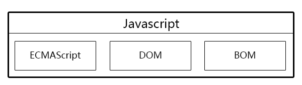
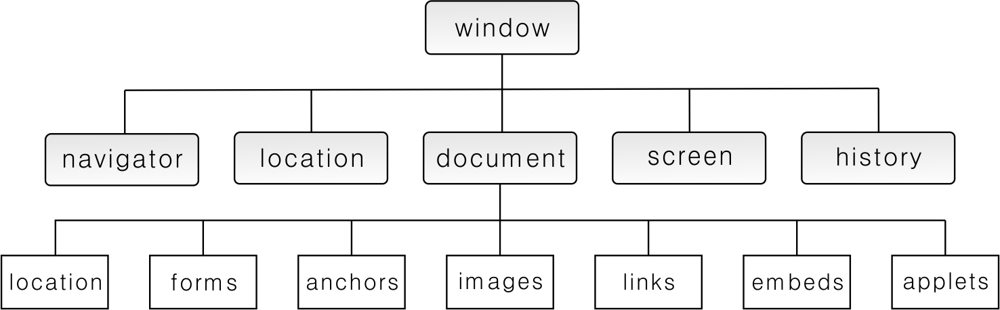
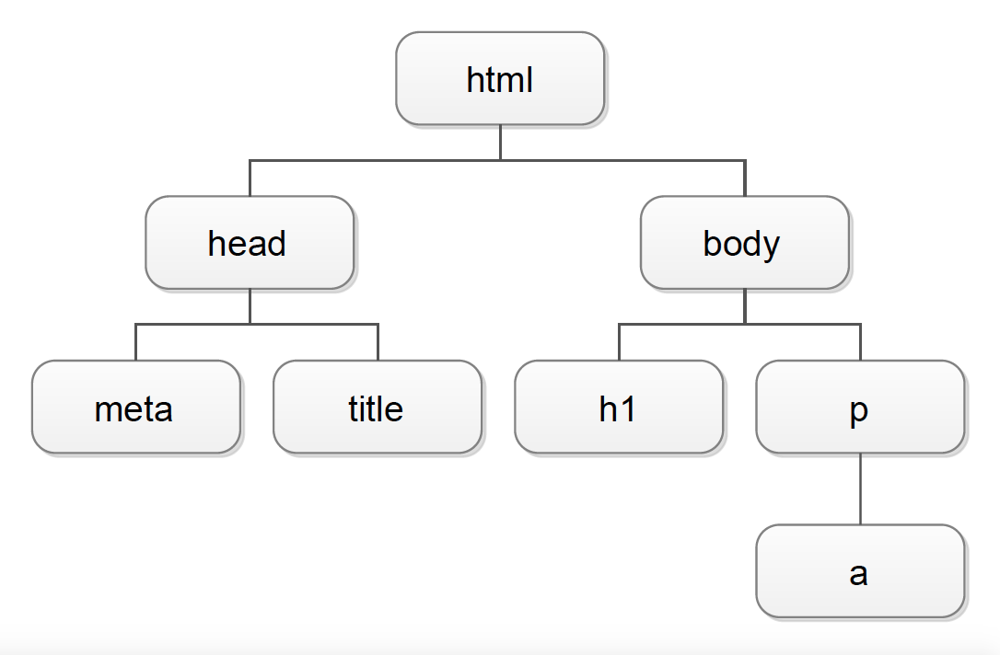
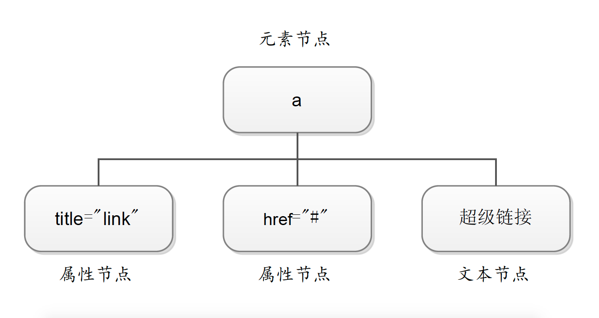

# 全局对象

完整的JavaScript包含三部分：ECMAscript、浏览器对象模型和文档对象模型。

```{r js, echo=FALSE, fig.show='hold', fig.cap='JavaScript', fig.align='center'}

```

## 浏览器对象模型 BOM

由于网页是在浏览器中运行的，因此 JavaScript 提供了一系列对象以便同浏览器窗口进行交互。这些对象有 window、navigator、location、document、screen 和 history 等，这些对象通称为浏览器对象模型（Browser Object Model），简称 BOM。

BOM 提供了独立于页面内容而与浏览器窗口进行交互的对象，其中 window 对象是整个 BOM 的核心，所有对象和集合都以某种方式与 window 对象关联。

navigator、location、document、screen 和 history 是 windows 对象的子集，document 对象又包含若干子对象（location、forms、anchors、images、links、embeds、applets），BOM 中的对象关系如图所示：

```{r BOM, echo=FALSE, fig.show='hold', fig.cap='BOM', fig.align='center'}

```

### window 对象

JavaScript 在一定的环境中运行，这个运行环境本身也是对象，称为“顶层对象”。这就是说，JavaScript 的所有对象，都是“顶层对象”的下属。不同的运行环境有不同的“顶层对象”，在浏览器环境中，这个顶层对象就是 window 对象。

Window 对象表示整个浏览器窗口，但不包括其中的页面内容，使用 window 对象可以直接对浏览器窗口进行操作。window 对象提供可以主要功能有：调整窗口大小和位置；打开新窗口和关闭窗口；系统提示框；状态栏控制；定时操作。由于 window 对象的属性和方法众多，我们就不一一作介绍，如想深入了解，请访问<https://developer.mozilla.org/zh-CN/docs/Web/API/Window>。

#### 常用属性

Window 对象拥有众多属性，常用的有：

1. **innerHeight** 浏览器显示区域高度
1. **innerWidth** 浏览器显示区域宽度
1. **document** window 对象的子对象 document 是 javascript 的核心对象，HTML 文档中包含 BODY 元素时就会创建一个 document 实例。
1. **location** 给出当前窗口的 URL 信息或指定打开窗口的 URL。

#### 常用方法

1. **close()** 关闭页面。
1. **open()** 打开页面。
1. **alert()** 弹出警告对话框。
1. **print()** 模拟用户点击浏览器上的“打印”按钮，通知浏览器打开打印对话框打印当前页。
1. **confirm()** 显示需要用户确认信息的对话框。
1. **scrollTo()** 将窗口中的内容滚动到指定位置。
1. **scrollByPages()** 滚动当前文档到指定页。
1. **setTimeout()** 在指定的延迟时间之后调用一个函数或执行一个代码片段。
1. **setInterval()** 周期性地调用一个函数 (function) 或者执行一段代码。

window 对象的属性和方法在调用时，可以省略其对象名称，即 window.innerHeight 可简写为 innerHeight。

例如：

```html
<html>
<body>
<input type="text" id="clock" />
<script language=javascript>
var int = setInterval("clock()",50);
function clock() {
  var t = new Date();
  document.getElementById("clock").value = t
  }
</script>
<button onclick="int=window.clearInterval(int)">Stop interval</button>
</body>
</html>
```

### navigator 对象

navigator 对象主要用来检查客户端浏览器信息、浏览器版本、操作系统的类型等等。navigator 对象最常用的属性是 userAgent，该属性能读取浏览器及操作系统的信息。

### location 对象

`location` 对象的主要作用是分析和设置页面的 `URL` 地址，其中 `location.herf` 属性用于获得和设置窗口的 `URL`。

### screen 对象

`screen` 对象主要用来获取用户计算机的屏幕信息，包括屏幕的分辨率、屏幕的颜色深度等信息。

### history 对象

`history` 对象主要用来控制浏览器的后退和前进。它可以访问历史页面，但不能获取历史页面的 `URL`。

### document 对象

从 BOM 的角度看，document 对象是一系列集合构成，这些集合可以访问文档的各个部分，并提供页面自身的信息。由于 BOM 没有统一标准，各种浏览器中的 document 对象特性并不完全相同，因此要使用各类浏览器都支持的通用属性和方法。常用的属性和方法有 `title`、`lastModified`、`write` 等等。

## DOM

文档对象模型 DOM（Document Object Module）是由 W3C 定义的提供与任何 HTML 或 XML 文档进行交互的 API（编程接口），可以说是 HTML 之后的又一伟大创新。它使得用户可以通过 javaScript 访问 HTML 文档中的任意元素和内容，DOM 提供的接口可以操作 HTML 文件中的节点。当浏览器加载一个网页后，这个网页就可以看作是文档树，由多个节点构成。所谓 DOM，就是将 HTML 文档中各个元素按照从属关系建立起的模型。总的来说，我们可以利用 DOM 完成以下应用：

1. 访问指定节点；
1. 访问相关节点；
1. 访问节点属性；
1. 检查节点类型；
1. 创建节点；
1. 为节点添加事件；
1. 操作节点。

### HTML 文档与 DOM

我们先看下面这个简单的 HTML 文档：

```html
<!DOCTYPE html>
<html lang="zh">
<head>
    <meta charset="utf-8">
    <title>一个简单的 HTML 文档</title>
</head>
<body>
    <h1>这是一个简单的 HTML 文档</h1>
    <p>文档中包含着段落和<a title="link" href="#">超级链接</a></p>
</body>
</html>
```

这个 HTML 文档的 DOM 可示例如下图：

```{r DOM, echo=FALSE, fig.show='hold', fig.cap='DOM', fig.align='center'}

```

在上面的 DOM 中，html 位于最顶端，是 DOM 的跟节点，`head` 和 `body` 是 `html` 的子节点，它们属于同一层，并不互相包含，是兄弟关系，`h1` 和 `p` 是兄弟元素，其父元素是 `body`，`p` 的子元素是 `a` 元素。

### 节点

节点（node）的概念来源于计算机网络，它代表网络中的一个连接点。在 DOM 中，文档也是由节点构成的集合。DOM 定义了多种节点，常用的是元素节点、文本节点、和属性节点，分别对应元素、元素中包含的文字内容和元素的属性。

例如上面的代码中：

```html
<a title="link" href="#">超级链接</a>
```

`a` 元素的 `title` 和 `href` 属性就是 `a` 元素节点的属性节点，`a` 元素所包含的内容“`超级链接`”就是文本节点。如下图所示：

```{r node, echo=FALSE, fig.show='hold', fig.cap='节点(node)', fig.align='center'}

```

### 使用 DOM

DOM 提供了一种访问文档内容的机制，我们可以使用 DOM 处理 HTML 文档的内容。DOM 由节点（node）构成，每一个节点，都有一系列的属性、方法可以使用，常用属性、方法见下表：

| 属性/方法  |  类型/返回类型  |  说明  |
|------------|-----------------|--------|
|nodeName | String  | 节点名称 |
|nodeValue | String  | 节点的值 |
|nodeType | Number  | 节点类型 |
|firstChild | Node    | childNodes 列表的第一个节点 |
|lastChild | Node    | childNodes 列表的最后一个节点 |
|childNodes | NodeList | 所有子节点列表，方法 item(i) 可以访问其中节点 |
|parentNode | Node    | 父节点 |
|previousSibling | Node    | 指向前一个兄弟节点 |
|nextSibling | Node    | 指向后一个兄弟节点 |
|hasChildNodes() | Boolean | 是否包含子节点 |
|attributes | NameNodeMap | 包含一个元素特性的 Attr 对象 |
|appendChild(node) | Node    | 将 node 节点添加到 childNodes 末尾 |
|removeChild(node) | Node    | 从 childNOdes 中删除 node 节点 |
|repaceChild(new,old) | Node    | 将 childNodes 中的 oldnode 节点替换为 newnode 节点 |
|insertBefore(new,ref) | Node    | 在 childNOdes 中的 refnode 节点之前插入 newnode 节点 |
|innerHTML | String  | 读取或者设置某个标记之间的所有内容 |
|className | String  | 读取或者设置节点的 CSS 类别 |

#### 访问节点

DOM 提供了一些很便捷的方法来访问文档的节点，最常用的是 `getElementsByTagName()` 和`getElementById()`，此外比较常用的是 `getElementsByName()`、`getElementsByClassName()`;

```javascript
……
        var oLi = document.getElementsByTagName('li');
        for(var i = 0 in oLi) {
        console.log(i + '=' + oLi[i]);
    }
        console.log(oLi);
        console.log(oLi.length);
        console.log(oLi[0].childNodes[0].nodeValue);
……
```

将访问 `oLi` 子节点列表中的第一个节点的值。

#### 检测节点类型

通过节点的 `nodeType` 属性可以检测出节点的类型，DOM 定义了 12 种类型，大多数情况下，我们用到的是以下类型：

1. `ELEMENT_NODE` 元素节点 nodeType 的值为 1；
1. `ATTRIBUTE_NODE` 属性节点 nodeType 的值为 2；
1. `TEXT_NODE` 文本节点 nodeType 的值为 3；

#### 利用父子兄关系查找节点

在获取了某个节点之后，可以通过父子关系，利用 `hasChildNodes()` 方法和 `childNodes` 属性获取该节点所包含的所有子节点。例如：

```javascript
……
        var oLi = document.getElementById('myList');
        var DOMString = "";
        if(oLi.hasChildNodes()){
            var oChild = oLi.childNodes;
            for(var i=0; i<oChild.length;i++){
                DOMString += oChild[i].nodeName + "\n";
            }
        }
        console.log(DOMString);
……
```

从运行结果我们可以看出，不光有元素节点，连它们之间的空格也被当成了子节点。

通过 `parentNode` 属性，可以获取父元素节点。如：

```javascript
……
        var myItem = document.getElementById('active');
        console.log(myItem.parentNode.tagName);
……
```

DOM 还提供了处理兄弟之间关系的属性和方法，如 `nextSibling`、`previousSibling`。

#### 设置节点属性

找到节点后，可以通过 `getAttribute()`、`setAttribute()` 方法取得或者设定节点的属性。

```javascript
……
var myItem = document.getElementById('active');
console.log(myItem.parentNode.tagName);
console.log(myItem.getAttribute("title"));
myItem.setAttribute("title","主要用以和用户交互");
console.log(myItem.getAttribute("title"));
……
```

#### 创建和添加节点

创建元素节点采用 `creatElment()`, 创建文本节点采用 `creatTextNode()`, 创建文档碎片节点采用 `creatDocumentFragment()` 等等。

在插入元素之前，先将元素内容添加到元素节点，再将元素节点及其包含的文本节点添加到指定节点。

```javascript
……
var oP = document.createElement("p");
var oText = document.createTextNode("这是一个使用 DOM 生成的段落");
oP.appendChild(oText);
document.body.appendChild(oP);
……
```

#### 删除节点

删除节点使用 `removeChild()` 方法，通常先找到要删除的节点，然后利用 `parentNode` 属性找到父节点，然后使用父节点的 `removeChild` 方法。

```javascript
……
<body onload="removeLi()">
    <ul id="myList">
        <li>HTML</li>
        <li>CSS</li>
        <li id="active" title="JavaScript 是脚本编程语言">JavaScript</li>
    </ul>
    <script>
    function removeLi() {
        var oLi = document.getElementById('active');
        oLi.parentNode.removeChild(oLi);
    }
    </script>
</body>
……
```

#### 替换节点

DOM 提供 `replaceChild()` 方法来替换节点，具体过程和删除节点类似，先找到想要替换的节点，再创建新节点，然后使用父节点替换方法。

```javascript
……
<body onload="replaceLi()">
    <ul id="myList">
        <li>HTML</li>
        <li>CSS</li>
        <li id="active">JavaScript</li>
    </ul>
    <script>
    function replaceLi() {
        var oOldLi = document.getElementById('active');
        var oNewLi = document.createElement('li');
        var oText = document.createTextNode('ECMAScript');
        oNewLi.appendChild(oText);
        oOldLi.parentNode.replaceChild(oNewLi,oOldLi);
    }
    </script>
</body>
……
```

#### innerHTML 属性

`innerHTML` 属性虽然不是 W3C DOM 的组成部分，但它得到了目前主流浏览器的支持。该属性表示某个标记之间的所有内容，包括代码本身。

``` javascript
var oLi = document.getElementById('active');
console.log(oLi.innerHTML);
oLi.innerHTML = "<a href='http://www.baidu.com'>Baidu</a>";
```

#### className 属性

className 属性是一个非常实用的属性，可以修改一个节点的 CSS 类别。

```javascript
var oLi = document.getElementById('active');
console.log(oLi.className);
oLi.className += ' jsdemo';
console.log(oLi.className);
```

使用 `className` 属性如果要追加 CSS 样式，而不是覆盖 CSS 样式的话，使用“`+=`”连接运算符，另外注意不同的样式名称使用空格分割。

## JSON

JSON 是一种轻量级的数据交换语言，基于 JavaScript 语法，但又独立于 JavaScript，JSON 数据格式与语言无关，由 Douglas Crockford 创造。

JSON 用于描述资料结构，有两种结构存在：

1. 对象（object）：一个对象包含一系列非排序的名称／值对 (pair)，一个对象以`{`开始，并以`}`结束。每个名称／值对之间使用`:`分区。
1. 数组 (array)：一个数组是一个值 (value) 的集合，一个数组以`[`开始，并以`]`结束。数组成员之间使用`,`分区。

具体的格式如下：

名称和值之间使用`:`隔开，一般的形式是：

```json
{name:value}
```

一个名称是一个字符串。

一个值 (value) 可以是一个字符串 (string)，一个数值 (number)，一个对象 (object)，一个布尔值 (bool)，一个有序列表 (array)，或者一个 null 值。

### 转义

由于 JSON 语法中使用了花括号，单引号、双引号和冒号，所以要在内容中使用上述符号的话，就需要特殊处理，即进行转义，转义的方式是加反斜线`\`，例如：

```json
{
    "content":"\{"
}
```

### 方法

#### JSON.parse()

将字符串解析为 JSON。

#### JSON.stringify()

返回指定值的 JSON 字符串。

## 控制台

在开发学习过程中，我们经常使用console.log()输出信息，方便调试。

### 性能分析

可以使用控制台中的计时功能，获取代码执行的时间，以便优化代码质量。

```js
console.time("timer");
for(var i=0;i<10000;i++){}
console.assert(a===1,"这时候条件是a==1,实际a是1");
console.assert(b===1,"这时候条件是b==1，实际b是2");
console.warn("这是一段警告信息");
console.error("出错啦，你的配置信息有误");
console.timeEnd("timer");
```
